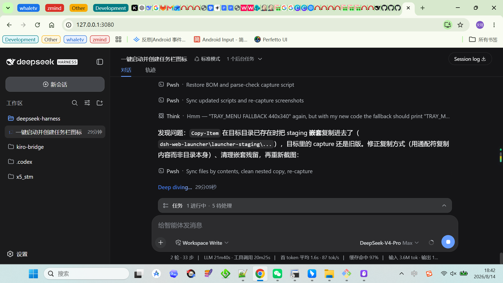
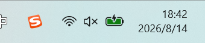
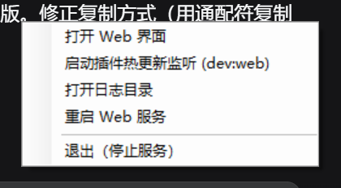
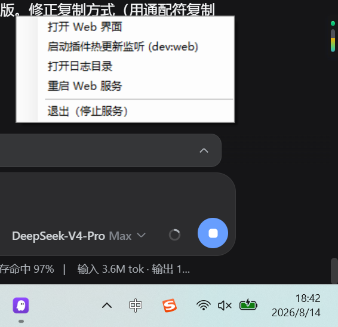

# DeepSeek Harness Web Launcher

> **v2.0.4** — Now includes an [Electron desktop client](#electron-desktop-client) with multi-tab, Chrome extensions, and auto-update.

One-click Windows launcher for the [DeepSeek Harness](https://github.com/deepseek-ai/deepseek-harness) Web UI. Two modes available:

- **PowerShell Launcher** — lightweight tray icon, opens in your default browser
- **Electron Desktop** — standalone window with tabs, extensions, global shortcut, harness auto-update

> 中文说明见 [README.zh.md](README.zh.md)。

---

## Electron Desktop Client

A standalone desktop app — no browser needed. See [`electron/README.md`](electron/README.md) for full documentation.

### Quick Start

```powershell
# One-click setup + launch:
powershell -NoProfile -ExecutionPolicy Bypass -File electron\scripts\setup.ps1

# Or step by step:
cd electron
pnpm install
pnpm start
```

### Key Features

- **Multi-tab** — Ctrl+T new tab, Ctrl+W close, Ctrl+R reload, Ctrl+Tab / Ctrl+Shift+Tab switch, middle-click close
- **New Tab dashboard** — tray 「New Tab」and Ctrl+T open a local start page with an address bar, editable bookmarks and backend status
- **Theme sync** — switching appearance (light/dark/system) inside DSH recolors every New Tab page and the tab bar live
- **System tray** — close button minimizes to tray, double-click to restore
- **Global shortcut** — Alt+D toggles window visibility, F12 toggles DevTools of the active tab
- **Chrome extensions** — load unpacked extensions via tray menu
- **Harness auto-update** — one-click `git pull` + `pnpm install` + `pnpm run build` from tray menu
- **App auto-update** — checks GitHub Releases for new client versions
- **i18n** — default Chinese, switchable to English in Settings
- **Sandboxed browsing** — websites opened in tabs are cut off from desktop controls (config writes, backend restart, update flows)
- **Window state restore** — normal size/position/maximized state survive restarts

### Build Distributable

```powershell
powershell -NoProfile -ExecutionPolicy Bypass -File electron\scripts\setup.ps1 -Build
# Output: electron\dist\ (NSIS installer + portable exe)
```

---

## PowerShell Launcher (Legacy)

The original lightweight tray-icon launcher — opens DSH Web in your default browser.

### Features

- Locates your `deepseek-harness` checkout automatically (explicit `-RepoRoot`, `DSH_REPO_ROOT` env var, `repo-root.txt`, or structure-based auto-discovery).
- Starts the Web UI with `pnpm dsh web` in a hidden window; no console window stays around.
- Opens `http://127.0.0.1:3080` in your default browser as soon as the service is ready.
- Shows a tray icon in the taskbar notification area with a right-click menu:
  - Open Web UI (double-clicking the tray icon does the same)
  - Start/stop HMR watcher (dev:web) (toggle the client-plugin HMR watcher)
  - Open log folder
  - Restart Web service
  - Exit (stop service)
- Single instance: launching it again just re-opens the browser.
- If a service started from a command line is already running on port 3080, the launcher adopts it; on exit it asks before stopping it.
- Configurable port via `-Port` parameter.
- Background health monitoring: notifies via balloon when the service process crashes.
- Automatic locale detection: UI text displays in Chinese or English based on system language.
- Logs go to `logs\` inside this repository.

### Screenshots

| Desktop shortcut | Tray icon | Right-click menu | Menu + taskbar |
| --- | --- | --- | --- |
|  |  |  |  |

> Screenshots are captured from a real run with `tools\capture-screenshots.ps1`; re-run it to refresh them after UI changes.

### Install

```powershell
powershell -NoProfile -ExecutionPolicy Bypass -File install.ps1
# or with explicit path:
powershell -NoProfile -ExecutionPolicy Bypass -File install.ps1 -RepoRoot "D:\code\deepseek-harness"
```

### Uninstall

```powershell
powershell -NoProfile -ExecutionPolicy Bypass -File install.ps1 -Uninstall
```

---

## Requirements

- Windows 10/11
- Node.js and [pnpm](https://pnpm.io/) — use the same versions required by your `deepseek-harness` checkout (see its `engines` field in `package.json`).
- A `deepseek-harness` checkout with dependencies installed:
  ```sh
  cd <your-checkout>
  pnpm install
  pnpm run build   # builds apps/web; required before the first launch
  ```

## How the harness checkout is located

Priority order (shared by both launcher modes):

1. `-RepoRoot <path>` argument / stored config
2. `DSH_REPO_ROOT` environment variable
3. `repo-root.txt` next to `start-web.ps1` (written by `install.ps1`, git-ignored)
4. Auto-discovery (structure-based scan, not limited to a specific folder name):
   - All subdirectories alongside and above the launcher (up to 4 levels)
   - Drive root: common names `deepseek-harness`, `dsh`, `DeepSeek`
   - All subdirectories under the user's home folder (`%USERPROFILE%`)

A directory is accepted when it contains `package.json`, `apps\cli\src\bin.ts`, and `apps\web\`. **The folder name does not matter** — the launcher identifies the harness purely by its internal structure, so you can name it anything you like.

When a matching directory is found, the launcher also checks its git remote. If the remote URL does not match `deepseek-harness`, a warning is displayed so you can confirm it's the right repo. Non-git directories (e.g. extracted archives) are accepted with a note.

## Repository layout

```
dsh-web-launcher/
├── electron/                        # Electron desktop client (v2.0)
│   ├── package.json                 # Electron + builder config
│   ├── pnpm-workspace.yaml          # pnpm workspace marker
│   ├── README.md                    # Full Electron documentation
│   ├── scripts/
│   │   ├── setup.ps1                # One-click install + launch
│   │   └── setup.bat                # Same, for cmd.exe
│   └── src/
│       ├── main/index.js            # Main process (window, tray, tabs, backend, extensions, updater)
│       ├── main/locale.js           # i18n strings (zh/en)
│       ├── preload/index.js         # Context bridge (safe IPC)
│       └── assets/
│           ├── shell.html           # Tab bar UI
│           ├── newtab.html          # New Tab dashboard
│           ├── splash.html          # Startup splash
│           └── update-progress.html # Harness/launcher update progress
├── start-web.ps1                    # PowerShell launcher (tray icon + service control)
├── install.ps1                      # PowerShell installer/uninstaller
├── refresh-icon.ps1                 # Regenerate dsh-web.ico
├── lib/common.ps1                   # Shared helpers (discovery, runners, probing, i18n)
├── tools/capture-screenshots.ps1    # Documentation screenshot capture
├── docs/screenshots/                # Screenshots referenced by READMEs
├── dsh-web.ico                      # Tray / shortcut icon
├── VERSION                          # Project version (keep in sync with electron/package.json)
├── logs/                            # Runtime logs (git-ignored)
└── repo-root.txt                    # Local checkout path (git-ignored)
```

## Troubleshooting

- **Tray balloon says the checkout was not found** — run `install.ps1 -RepoRoot "<path>"`, or set `DSH_REPO_ROOT`.
- **The service exits immediately** — open `logs\web-server.err.log`; usually missing `pnpm install` / `pnpm run build` in the checkout.
- **Port 3080 is occupied by another app** — the launcher treats a ready-but-not-dsh service as "already running" only when the response contains the `__DSH_BOOT__` marker; otherwise start-up fails and the log shows the port conflict. Use `-Port` to choose a different port.
- **Electron: "检查更新" shows error** — ensure `git` is in your system PATH and the harness directory is a git repo with a configured remote.
- **Multiple checkouts on one machine** — run `install.ps1` per checkout; rename the first shortcut before installing the next one, since the shortcut name is fixed.
- **Tray icon is hidden** — drag it out of the taskbar overflow area ("Show hidden icons").
- **Balloon says service exited unexpectedly** — the health monitor checks every 30 seconds; open `logs\web-server.err.log` for details, then use the tray menu to restart.

## License

MIT — see [LICENSE](LICENSE).

This launcher is an auxiliary tool for [DeepSeek Harness](https://github.com/deepseek-ai/deepseek-harness) (MIT licensed) and does not vendor or copy any harness code. It only starts the harness binaries from your local checkout and reads the checkout's `apps/web/public/favicon.svg` when the icon is regenerated. The harness checkout itself is a separate repository governed by its own license; see the harness repository's LICENSE and THIRD_PARTY_NOTICES.md for the terms of the harness and its dependencies.